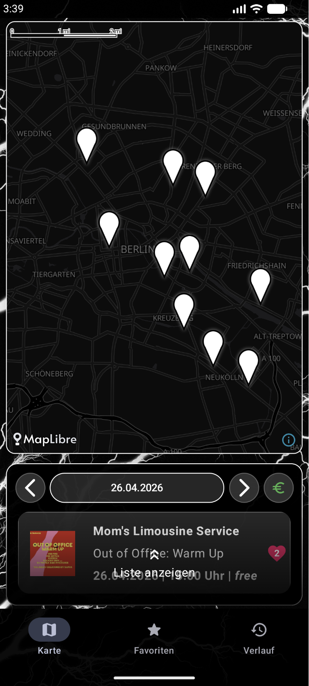
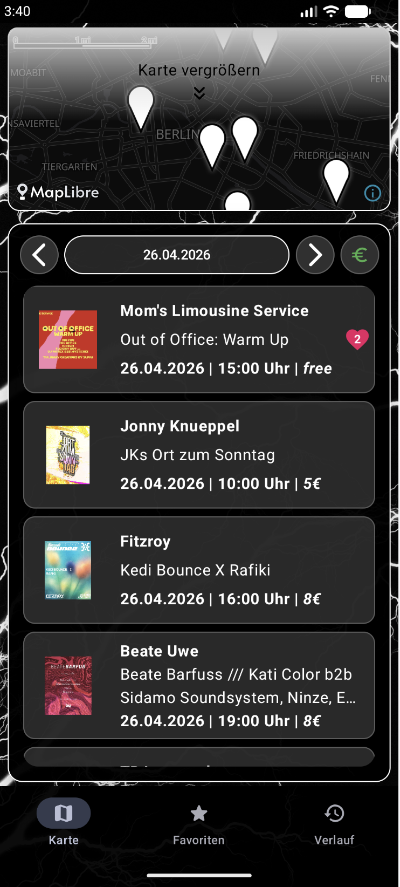
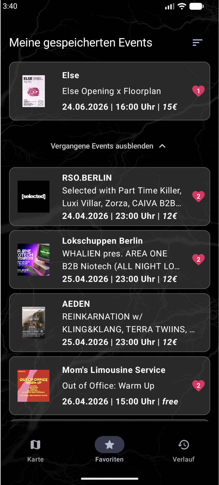
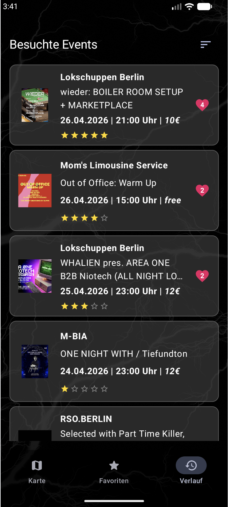
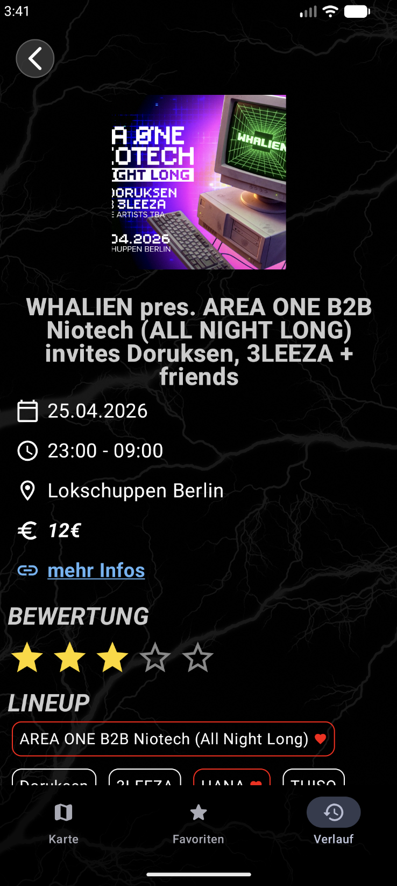

# Berlin Party Map

**Finde raus, was heute in Berlin wirklich geht.**

Berlin Party Map bringt Struktur ins Berliner Nachtleben.
Statt dich durch Industry-gesponsorte Eventseiten zu klicken, wo in erster Linie die Events gezeigt werden, wo am meisten Geld für Werbung ausgegeben wird, bekommst du hier eine klare, visuelle Übersicht über Events in der Nähe und für wenig Geld.

Die App richtet sich an Locals, Zugezogene und Besucher:innen, die schnell verstehen wollen, wo etwas passiert und ob es sich lohnt hinzugehen.
Der Fokus liegt darauf sich einen schnellen Überblick zu machen, ob es günstige Events in der Nähe gibt und soll die Zugänglichkeit von Feiern gehen in Berlin verstärken.

## Design

  
  
  
  
  

## Setup

Dieses Projekt basiert auf Android (Kotlin + Jetpack Compose).

## Features

- [x] Interaktive Kartenansicht mit Clubs und Events
- [x] Visuelle Darstellung von Events basierend auf ihrer Location
- [x] Detailansicht für Events (Datum, Beschreibung, Lineup)
- [x] Kombination aus Karten- und Listenansicht
- [x] Sortierungsfunktionen (nach Preisen & zuvor gelikter Artists)
- [x] Events speichern (Favorites)
- [x] History-Funktion für vergangene Events
- [x] Strukturierte Darstellung von Artists pro Event
- [x] Lokales Caching für bessere Performance
- [x] Klare, reduzierte UI im Dark Mode
- [x] Saubere Trennung von UI und Datenlogik (MVVM)
- [x] Vorbereitung für Backend-/Server-Anbindung (Ktor)

Geplant / in Arbeit:

- [ ] Filter nach Genre und Club
- [ ] Suche nach Artists, Events und Locations
- [ ] Sortierung nach Distanz oder Relevanz
- [ ] Favorisierte Clubs markieren
- [ ] Verbesserte Event-Empfehlungen

## Technischer Aufbau

### Projektstruktur (MVVM)

Die App ist in einer MVVM-Architektur aufgebaut und klar in Schichten getrennt:

- UI (Jetpack Compose)
- ViewModels
- Models
- Repository Layer
- Data Layer (Remote + Local)
- Dependency Injection (Koin)

### Datenspeicherung

Aktuell nutzt die App eine lokale Room-Datenbank zur Speicherung und Verarbeitung der Daten.

Gespeichert werden:
- Events
- Artists / Lineups
- Beziehungen zwischen Events und Artists
- Favorisierte Events
- Event-History

Die lokale Speicherung dient aktuell als Prototyp-Ansatz, um:
- eine stabile Datenstruktur zu entwickeln
- schnelle Ladezeiten zu gewährleisten
- die App unabhängig von einer finalen Backend-Lösung testen zu können

Langfristig ist eine Umstellung auf eine Online-Datenbank mit Synchronisation geplant.

### API

Die App bezieht Eventdaten über eine API auf einem lokalen ktor-Server. Zu präsentationszwecken, wurden hier jedoch Mockdaten verwendet.

Verarbeitet werden:
- Events
- Artists

## Ausblick

- [ ] Online-Datenbank + Login (personalisierte Nutzung & Sync)
- [ ] Eigene Location auf der Karte anzeigen
- [ ] Push-Benachrichtigungen für neue Events & Favoriten
- [ ] Kommentare & Interaktionen bei Events
- [ ] Light Mode / Theme Switching

Berlin Party Map ist als Grundlage für eine skalierbare Event-Plattform gedacht – mit Fokus auf Übersicht, Bezahlbarkeit und einem leichteren Zugang zum Berliner Nachtleben.
